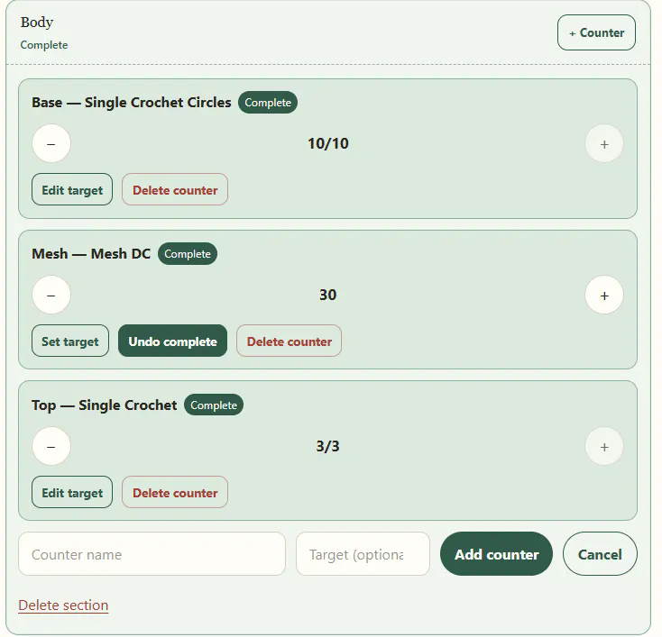
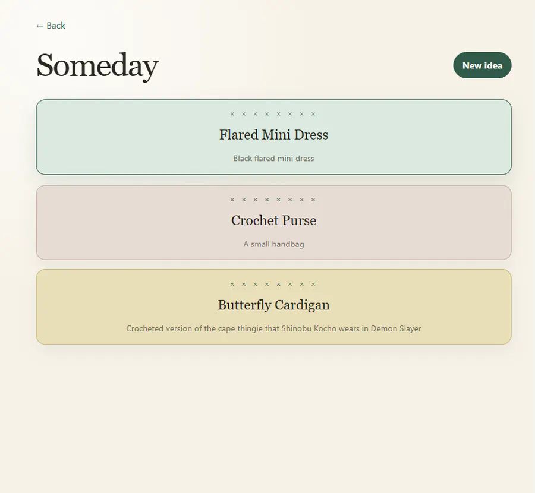
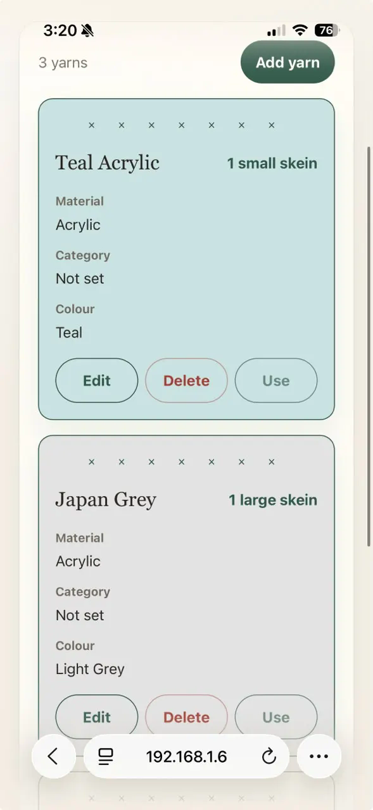

# Hooked

Hooked is a mobile-first crochet project tracker built as an installable progressive web app. It keeps active projects, future ideas, finished pieces, row counters, and yarn inventory together in one calm, crochet-inspired workspace.

**Live app:** [hooked.silviparlani-05.workers.dev](https://hooked.silviparlani-05.workers.dev)

## What it does

- **On the Hook** — manage active crochet projects, materials, pattern sources, sections, stitch details, and row counters.
- **Someday** — save project ideas and turn them into active projects when you are ready.
- **Made** — keep a record of completed work, completion dates, and project photos.
- **Stash** — catalogue yarn by name, material, category, colour, quantity, unit, and recommended hook size.
- Install to an iPhone home screen through Safari and use the responsive interface like an app.
- Keep project data synchronized through Firebase and optimized photos in Cloudinary.

## Screenshots

### Project sections and counters



### Someday ideas



### Yarn stash on iPhone



## Technology

- React 19, TypeScript, Vinext, and Vite
- Firebase Authentication and Firestore
- Cloudinary for completed-project photos
- Cloudflare Workers for deployment and GitHub-connected builds
- Vitest, Testing Library, Playwright, and the Firebase Emulator Suite

## Run locally

### Prerequisites

- Node.js 22.13 or newer
- npm
- Java 21 or newer only when running Firebase emulator tests

### Setup

```bash
cd app
npm install
```

Copy `app/.env.example` to `app/.env.local` and supply your own Firebase and Cloudinary configuration. Never commit `.env.local` or server credentials.

Start the development server:

```bash
npm run dev
```

The project uses `package.json` and `package-lock.json` for dependencies. A Python `requirements.txt` file is therefore not required.

## Checks

Run these commands from `app/`:

```bash
npm run typecheck
npm run lint
npm test
npm run test:e2e
npm run test:firebase
npm run build
```

The first browser-test run may require `npx playwright install chromium`.

## Deployment

Production builds are deployed to Cloudflare Workers from the GitHub repository. Cloudflare uses:

```text
Root directory: /app
Build command: npm run build
Deploy command: npx wrangler deploy --config dist/server/wrangler.json
```

Production environment variables are configured in Cloudflare rather than committed to the repository.

## Documentation

- [Product and architecture design](design.md)
- [Implementation plan and verification checklist](plan.md)
- [Developer notes](app/README.md)

## Privacy

Hooked is designed for private, authenticated project data. Firebase rules restrict data to its owner, while completed-project image delivery uses Cloudinary URLs. Passwords, authentication tokens, personal photos, and environment secrets must never be committed to the repository.

